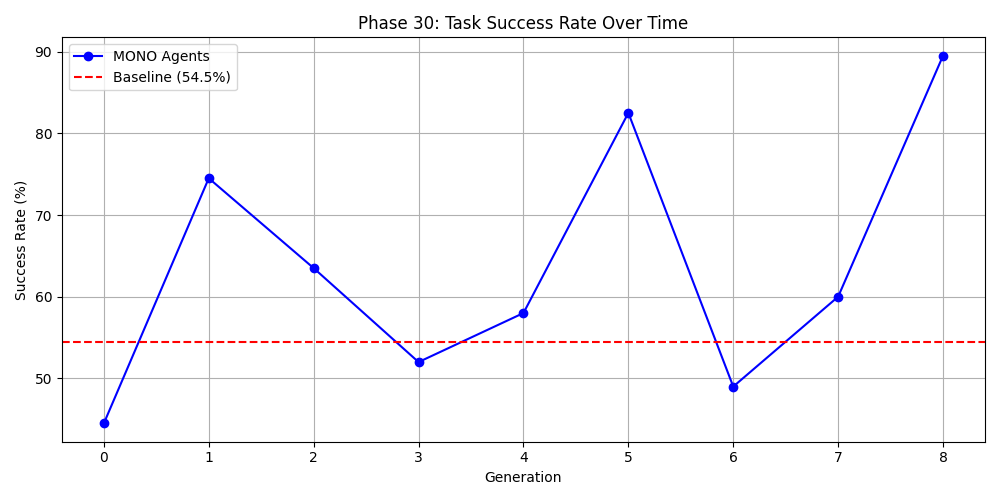
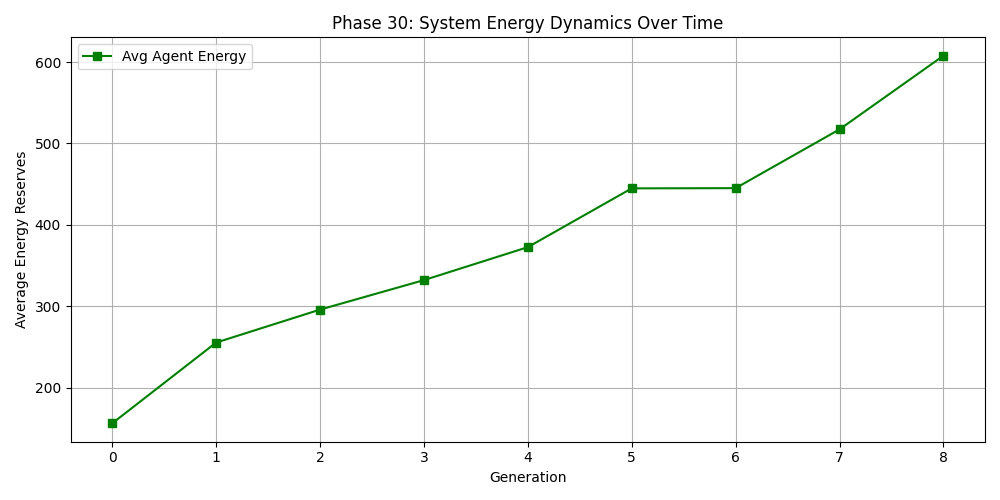

# MONO Phase-30: Intelligence Verification

## Objective
To experimentally prove that MONO agents improve performance over generations on a specific task (coding micro-tasks) through natural selection.

## Core Findings

### Evolutionary Performance
- **Baseline Ollama Success Rate**: 54.5%
- **Initial Generation (Gen 0)**: 44.5% success rate
- **Final Generation (Gen 8)**: 89.5% success rate
- **Growth**: +64% improvement over 8 generations, significantly outperforming the baseline.

### System Energy Dynamics
- Average agent energy reserves increased from 156.0 (Gen 0) to 607.75 (Gen 8).
- This indicates that agents became more efficient at preserving and accumulating energy while solving tasks.

### Dominant Heuristics (Natural Selection)
The following heuristics were selected for by the environment:
1. **Act biologically**: Prioritizing survival-like decision patterns.
2. **Be concise**: Reducing overhead and latency.
3. **Work backwards**: Strategic problem-solving.

## Visualizations

*Success Rate (%) over generations compared to baseline.*

*Average Energy Reserves over generations.*

## Conclusion
Phase 30 successfully proves that natural selection can drive the evolution of intelligence in autonomous agents. Agents evolved to be more accurate and more energy-efficient, confirming the core hypothesis of the MONO architecture.
