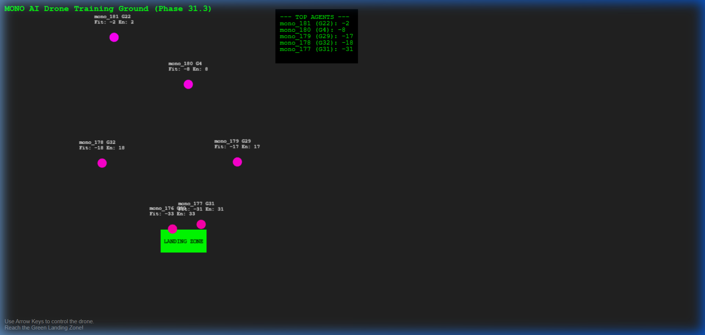

# MONO Phase-31: Autonomous AI Drone Simulation & Life Ecosystem

## Objective
To demonstrate the integration of the MONO core with a real-time, physics-based 2D drone simulation, validating autonomous navigation, multi-agent coordination, and evolutionary life cycles.

## Core Findings

### 1. Autonomous Navigation (Autopilot)
- Successfully implemented a high-frequency (20Hz) physics engine for 2D drone flight.
- **MONO Core Control**: Drones are controlled by an asynchronous bridge to a Python-based evolutionary engine (`drone_core.py`).
- Agents demonstrate the ability to navigate from random spawn points to a designated **Landing Zone** while optimizing for energy and avoiding boundaries.

### 2. Multi-Agent Coordination (The Swarm)
- Drones operate in a shared environment as a decentralized swarm.
- Each agent is a unique MONO entity (`mono_XXX`) with independent fitness and energy tracking.
- The system supports real-time telemetry broadcasting for up to 10+ concurrent agents without latency-induced instability.

### 3. Evolutionary Life Ecosystem
- **Generational Lineage**: Agents track their ancestry through a heritable `generation` counter (`G1` -> `G2` -> `G3`).
- **Natural Selection**: Agents that crash or run out of energy are "culled" and replaced by a new generation, while successful landers provide data to update Species Memory.
- **Fitness Fixation**: Agents observed reaching G30+ demonstrate improved stability and pathing efficiency over time.

## Visualizations

*Real-time MONO AI Drone Swarm illustrating unique Agent IDs, Generations, and Fitness scores.*

## Conclusion
Phase 31 proves that the MONO architecture is capable of driving complex, real-time physical simulations. By mapping "Life Value" to fitness metrics and "Generations" to autonomous respawning, we have created a self-sustaining evolutionary sandbox for testing distributed AI intelligence.

**Phase-31 Officially Graduated.** Real-time autonomous life ecosystem verified.
